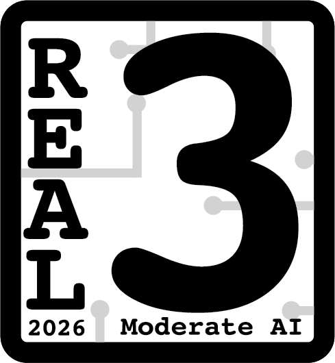

# uWelcome

*uWelcome is a configurable CLI Banner made for your favorite Linux systems!*

**WIP**: Some features still need testing.

**Contributions are welcome!** If you want to contribute, you're welcome to submit a pull request or [open an issue](https://github.com/theMimolet/uwelcome/issues) - it's very much appreciated ❤️

Want to configure or contribute to uWelcome ? Take a look at the [documentation](https://github.com/theMimolet/uwelcome/tree/main/docs) !

## Roadmap

Here are features that are planned for the future:

- Config option for the welcome message - to make it customizable [0.3.2]
- System commands that always displays a message following a script or such (not randomized) [0.3.3]
- Add CLI commands to customize the banner without touching the config file itself [0.4]

## How to try

### Install it with Homebrew

If you have Homebrew installed on your system, you can install uWelcome with the following command:

```sh
brew install themimolet/tap/uwelcome
```

It's the recommended way to install uWelcome on your system, as it will get updated via Homebrew.

### Download it from the releases page

You can download the latest release from the [releases page](https://github.com/theMimolet/uwelcome/releases).

You can then rename it to `uwelcome` and place it in your usual `/bin` folder.

> Note: You won't receive automatic updates, you will have to download uWelcome at each new release.

### Compile from source

You'll need to have [`go`](https://repology.org/project/go/versions) installed on your system to compile uWelcome from source.

Then you'll have to simply clone the repository and then build the binary:

```sh
git clone https://github.com/theMimolet/uwelcome
cd uwelcome
go build
./uwelcome
```

You'll then have the `uwelcome` binary in the current directory, which you can just drop into your usual `/bin` folder and it will work without any further setup (except for the configuration file if you want to customize it).

## Commands

uWelcome supports the following commands (for now):

```txt
toggle  - Toggles the MOTD on or off for the current user
enable  - Always enables the MOTD for the current user
disable - Always disables the MOTD for the current user
version - Displays the version of uWelcome currently in use
```

## AI usage

This project had mild AI involvement back when it was one with umotd, mainly for auto-completion in the code editor - nowadays it's being barely developped with any AI at all, and most content is written by hand (for practice and fun).

Due to past AI involvement, I give this project the following rating

[](https://www.realgoodai.org/real-rating)
